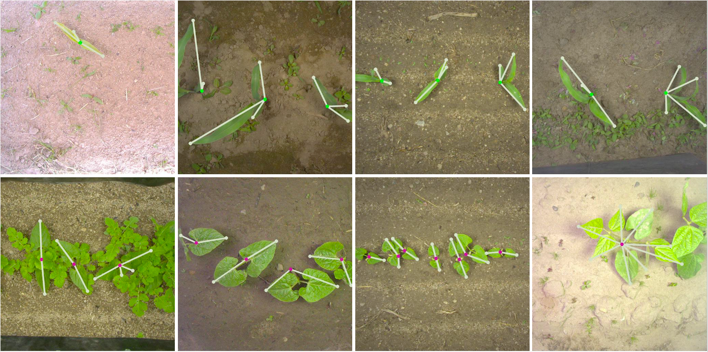

# Graph Structure Detection Network
Graph Structure Detector (GSDNet) is designed to detect the graph structure of objects, such as trees. This proof of concept is WIP and not published research.



## TODO
- [x] Basic Graph data structures and helpers
- [x] Remove everything not related to graphs
- [x] Visualization tools
- [x] Encoder
- [x] Dataset
- [x] Decoder
- [x] Trainer
- [x] Evaluator
- [x] Validation
- [x] Test with FPNTop
- [x] Test reducing `sigma_gauss`
- [x] Test heatmaps loss weight
- [ ] Test apex mixed-precision training

## Installation
Requirements:
- Python > 3.8
- Nvidia GPU with CUDA/CUDNN installed (recommended)

We recommend using a virtual environment:
```zsh
cd StructureDetector
git checkout graph-detection
python3 -m venv env
source env/bin/activate
```

Install required Python packages:
```zsh
pip install -U pip
pip install -r lock.txt
```

## Reproduce Our Results
TODO

## Training
TODO

## Contact
Feel free to ask you questions or request data at louis.lac@ims-bordeaux.fr.
