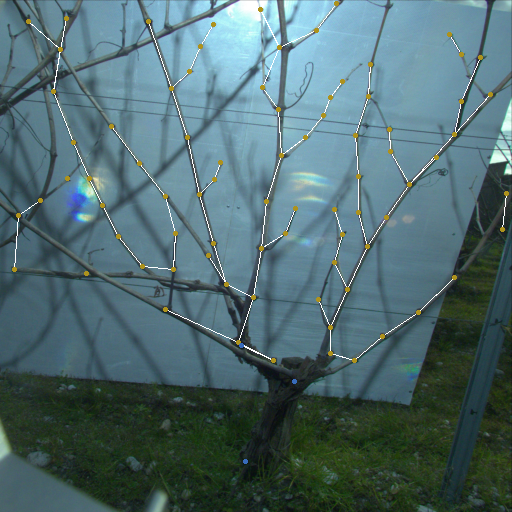

# Object Structure Detector

Structure Detector network (SDNet) is a pose estimation network which can detect an arbitrary number of keypoints. It is based on center point detectors such as [CenterNet](https://github.com/xingyizhou/CenterNet).

SDNet is a BMVC 2021 published work : <https://www.bmvc2021-virtualconference.com/conference/papers/paper_1278.html>.



## Installation

The project can be installed using uv:

```shell
uv sync
```

Supported accelerators:

* NVIDIA GPUs (CUDA)
* Apple Silicon GPUs (MPS)

## Reproduce Our Results

Download and put the validation dataset in `database/valid/` at the root directory of the repo, then execute this command:

```shell
evaluate --valid_dir database/valid --load_model model_best_classif.pth --anchor_name stem --conf_threshold 0.4 --decoder_dist_thresh 0.1 --dist_threshold 0.05
```

This should reproduce the results of our paper up to some small error margin depending on the hardware.

The dataset is currently in the process of being published. It can be accessed [here](https://data.mendeley.com/datasets/d7kbzjr83k/1). The trained network `best_model_classif.pth` is available on demand (see the contact address at the bottom).

## Train Your Own Model

### Annotation

Each image should have its corresponding annotation in the same folder, with the same name. The annotation is store in JSON format with the following structure:

```json
{
  "image_path": "database/valid/im_000000.jpg",
  "img_size": [
    2448,
    2048
  ],
  "objects": [
    {
      "label": "label",
      "parts": [
        {
          "kind": "anchor",
          "location": {
            "x": 685,
            "y": 820
          }
        },
        {
          "kind": "part_a",
          "location": {
            "x": 520,
            "y": 700
          }
        }
      ]
    }
  ]
}
```

Each annotation consists of a list of objects. Each of them has a label and a list of keypoints. An object should have exactly one keypoint of kind "anchor" and an arbitrary number of other keypoints. You can customize the anchor name in the command line arguments (`--anchor_name` option). All coordinates are in pixels relative to the top-left image corner.

You should also update the `label.json` file with the names of your labels and part kinds. Example with our dataset:

```json
{
    "labels": ["bean", "maize"],
    "parts": ["leaf"]
}
```

For annotating crops you can use [this repo](https://github.com/laclouis5/StructureAnnotator) or adapt it to your needs.

### Training

Split your dataset into two folders: one for training and the other for validation. Optionally launch TensorBoard to monitor training (use a secondary shell):

```shell
tensorboard --logdir runs
```

Launch training with:

```shell
train --train_dir train_dir/ --valid_dir valid_dir/
```

Customize training (epochs, learning rate, ...) by specifying options in the command line arguments. Help is available:

```shell
train -h
```

Best networks are saved in a `trainings/` directory created at the root directory.

## Convert to CoreML

For maximum prediction speed on Apple platforms the model can be compiled to a CoreML model:

```shell
convert_coreml <in_model.pth> --output <out_name.mlpackage>
```

The Xcode CoreML model explorer claims a median prediction speed of 5 ms on my MacBook Pro M1 Pro using the ANE and 13 ms using the GPU. In practice, in a more realistic setting (sub-optimal though) I've been able to achieve 90 fps (11 ms) using the ANE.

The performance can be benchmarked with `evaluate_coreml` and it is very close to the original network.

## Contact

Feel free to ask you questions or request data by [email](mailto:teaser-rainy.0y@icloud.com).
